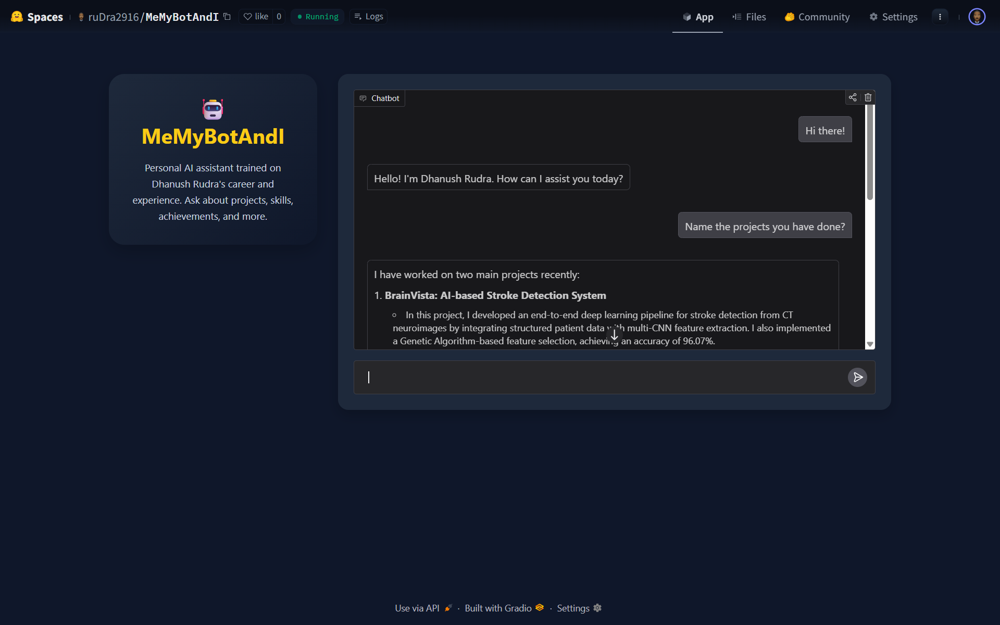
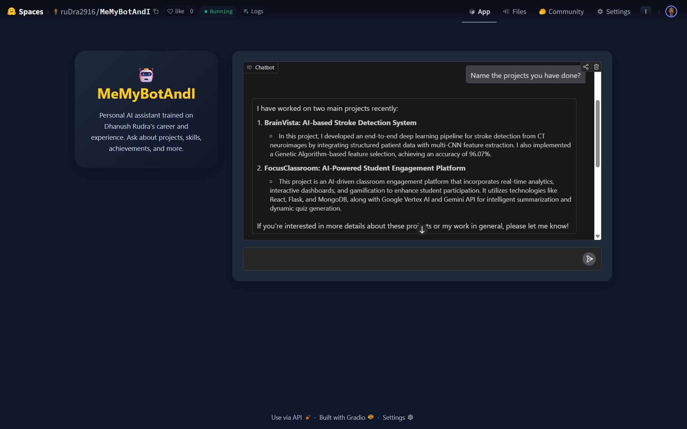
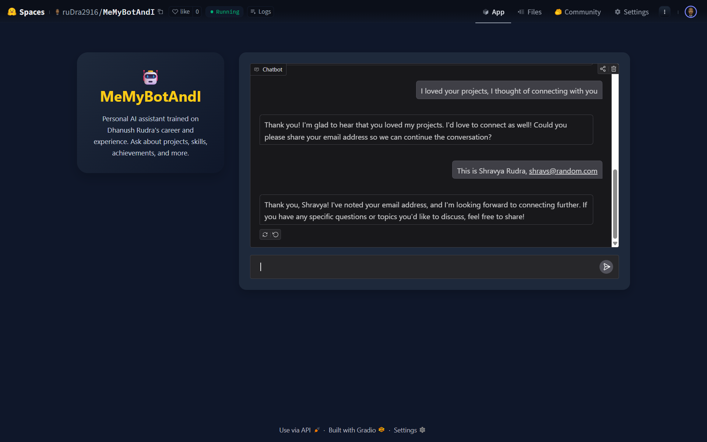
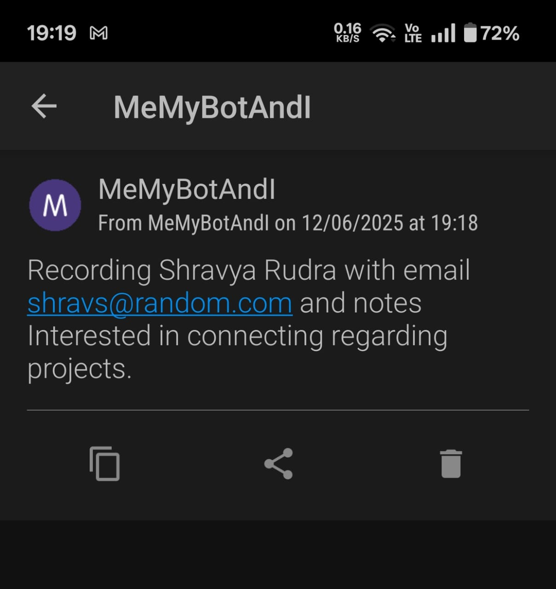

# 🤖 MeMyBotAndI – Your Personal AI Assistant

Modern professionals often struggle to present their profiles interactively on the web. Static resumes and text-heavy portfolio sites fail to create engagement. With the rise of conversational AI, we’ve built an intelligent assistant that can *represent Dhanush Rudra* in real-time conversations—answering questions about his career, skills, and projects just like he would.

*MeMyBotAndI* is a personalized chatbot powered by OpenAI, integrated with Gradio’s UI, that reads and responds to queries using Dhanush's actual resume and professional summary. It records leads, logs unknown questions, and provides a smooth, engaging experience for anyone exploring his work.

---

## 🖼 Interface Preview

  
*Initial chat interface layout*

  
*Interface - 2*

  
*Interface - 3*

  
Live push notification to developer via Pushover API

---

## 🧪 Methodology

The system is designed to act as a digital ambassador for Dhanush Rudra. Here’s how it works:

1. **Data Extraction**  
   - Loads a PDF resume using `pypdf`  
   - Parses a summary file containing high-level insights

2. **Conversational Logic**  
   - All messages are passed through OpenAI’s `gpt-4o-mini` with tool-use enabled  
   - The model is initialized with both resume and summary context  

3. **Tool Usage**  
   - If the user provides contact info, it’s logged via `record_user_details()`  
   - If the bot doesn't know the answer, the question is logged using `record_unknown_question()`

4. **User Interface**  
   - Built with Gradio Blocks  
   - Features a 25% left sidebar for branding, 75% right chat window  
   - Uses a dark mode theme with gold highlight styling

5. **Notifications**  
   - Push notifications are sent to the developer in real time using [Pushover API](https://pushover.net/)

---

## 📁 File Overview

| Filename                      | Purpose                                      |
|-------------------------------|----------------------------------------------|
| `main.py`                     | Main app logic including bot + Gradio UI     |
| `me/Dhanush_Rudra_Resume.pdf` | Resume used to extract content for the bot   |
| `me/summary.txt`              | Summary text file of Dhanush's experience    |
| `.env`                        | Stores API keys securely                     |
| `README.md`                   | This file                                    |

---

## 📦 Dependencies

Install all required libraries:

```bash
pip install -r requirements.txt
```

**Key Python packages:**

```txt
python-dotenv
openai
requests
pypdf
gradio
PIL
pdf2image
pytesseract
firebase-admin
pandas
pathlib
```

---

## 🚀 Deployment

To run locally:

```bash
python main.py
```

Set up your `.env` file like this:

```env
OPENAI_API_KEY=your-openai-key
PUSHOVER_USER=your-user-key
PUSHOVER_TOKEN=your-app-token
```

Or explore the live app on [Hugging Face Spaces](https://huggingface.co/spaces/ruDra2916/MeMyBotAndI)

---

## 📑 Summary

This project reimagines personal branding using real-time conversational AI. With automatic logging, lead capture, and a sleek interface, *MeMyBotAndI* offers a unique and interactive way to present your professional identity.

📄 *For more technical details, refer to `Design_Documentation.pdf` (coming soon).*
